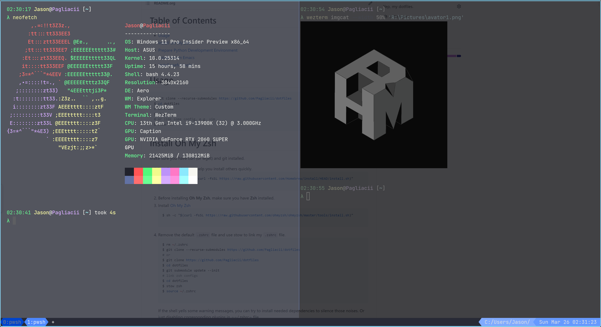

# Pagliacii's Dotfiles

> A comprehensive, cross-platform dotfiles collection featuring LazyVim, modern CLI tools, and streamlined development workflows.



**LazyVim Demo**: [View GIF](https://imgur.com/a/C5PaIhZ)

## ✨ Features

- 🚀 **LazyVim/Neovim** - Primary editor with 25+ modular plugin configurations
- 🤖 **AI Coding Assistant** - Avante.nvim with Claude Sonnet 4 and Moonshot providers
- 🐚 **Modern Shell** - Zsh + Oh My Zsh + Starship prompt
- 🛠️ **Development Tools** - Python (pyenv + Poetry), CLI utilities, terminal multiplexers
- 📝 **Multiple Editors** - Doom Emacs, Spacemacs, Vim configurations
- 🖥️ **Cross-Platform** - Unix/Linux/macOS primary, Windows support via AutoHotkey/GlazeWM
- 🔧 **GNU Stow** - Modular deployment system

## 🚀 Quick Start

```bash
# Clone with submodules (required)
git clone --recurse-submodules https://github.com/Pagliacii/dotfiles
cd dotfiles

# Deploy all configurations
stow

# Or deploy specific configurations
stow vim zsh lazyvim starship
```

## 📦 Installation

### Prerequisites

```bash
# Install Homebrew (macOS/Linux)
/bin/bash -c "$(curl -fsSL https://raw.githubusercontent.com/Homebrew/install/HEAD/install.sh)"

# Install essential dependencies
brew install stow zsh git curl
```

### 1. Shell Environment (Zsh + Oh My Zsh)

```bash
# Install Oh My Zsh
sh -c "$(curl -fsSL https://raw.githubusercontent.com/ohmyzsh/ohmyzsh/master/tools/install.sh)"

# Deploy shell configurations
rm ~/.zshrc
stow zsh
source ~/.zshrc

# Optional: Install enhanced prompt and utilities
brew install starship thefuck autojump
stow starship
source ~/.zshrc
```

### 2. Modern CLI Tools

```bash
# Core productivity tools
brew install fzf ripgrep fd bat lsd tree
brew install hyperfine hexyl glow htop neofetch

# Configure fzf key bindings and completion
$(brew --prefix)/opt/fzf/install

# Advanced tools
brew tap eth-p/software
brew install bat-extras wakatime-cli licensor httpie
```

### 3. Python Development Environment

```bash
# Install Python version manager
brew install pyenv pyenv-virtualenv

# Install Python (replace with desired version)
pyenv install 3.11.0
pyenv global 3.11.0

# Install Poetry for dependency management
curl -fsSL https://install.python-poetry.org | python3 -

# Deploy pip configuration (optional: custom PyPI sources)
stow pip

# Optional Python tools
pip install ipython bpytop
brew install pipx
pipx ensurepath
```

### 4. Editor Configurations

#### LazyVim (Primary)

```bash
# Deploy LazyVim configuration
stow lazyvim

# LazyVim will automatically install plugins on first run
nvim
```

#### Doom Emacs (Alternative)

```bash
# Install Emacs and dependencies
brew install emacs git ripgrep fd

# Deploy Doom Emacs configuration
stow doom-emacs

# Install Doom Emacs
~/.emacs.d/bin/doom install
~/.emacs.d/bin/doom doctor

# Optional: Add Doom to PATH
echo 'export PATH="$HOME/.emacs.d/bin:$PATH"' >> ~/.zshrc
```

### 5. Terminal & Multiplexers

```bash
# Install terminal multiplexers
brew install tmux zellij

# Deploy terminal configurations
stow tmux zellij alacritty wezterm

# Or choose specific terminals/multiplexers
stow tmux        # Traditional terminal multiplexer
stow zellij      # Modern terminal multiplexer with tabs/panes
stow alacritty   # GPU-accelerated terminal
stow wezterm     # Modern terminal with Rust/Lua config
```

### 6. Windows-Specific Tools

```bash
# Windows tiling window manager (Windows only)
stow glazewm

# Keyboard remapping (cross-platform)
stow kanata
```

### 7. Development Tools

```bash
# Go development environment
brew install go
stow golang

# Cheat sheet integration
brew install cheat
stow cheat.sh
```

## 🗂️ Repository Structure

```
dotfiles/
├── lazyvim/              # LazyVim/Neovim (primary editor)
│   └── .config/nvim/lua/plugins/  # 25+ plugin configurations
├── zsh/                  # Zsh shell with Oh My Zsh
├── starship/             # Cross-shell prompt
├── tmux/                 # Terminal multiplexer
├── zellij/              # Modern terminal multiplexer
├── alacritty/           # GPU-accelerated terminal
├── wezterm/             # Modern terminal
├── doom-emacs/          # Doom Emacs configuration
├── spacemacs/           # Spacemacs configuration
├── vim/                 # Traditional Vim
├── ranger/              # Console file manager
├── yazi/                # Modern terminal file manager
├── glazewm/             # Windows tiling window manager
├── kanata/              # Keyboard remapping
├── golang/              # Go development configuration
├── cheat.sh/            # Cheat sheet integration
├── pip/                 # Python package manager config
├── my_scripts/          # Custom scripts and utilities
│   ├── .local/bin/      # User binaries
│   └── scripts/dmenu/   # Productivity scripts
├── windows/             # Windows-specific configs
└── config_files/        # Shared configurations
```

## 🎯 Available Configurations

| Package      | Description                     | Deploy Command    |
| ------------ | ------------------------------- | ----------------- |
| `lazyvim`    | LazyVim/Neovim with 25+ plugins | `stow lazyvim`    |
| `zsh`        | Zsh with Oh My Zsh framework    | `stow zsh`        |
| `starship`   | Modern cross-shell prompt       | `stow starship`   |
| `tmux`       | Terminal multiplexer            | `stow tmux`       |
| `zellij`     | Modern terminal multiplexer     | `stow zellij`     |
| `alacritty`  | GPU-accelerated terminal        | `stow alacritty`  |
| `wezterm`    | Modern terminal emulator        | `stow wezterm`    |
| `doom-emacs` | Doom Emacs configuration        | `stow doom-emacs` |
| `spacemacs`  | Spacemacs configuration         | `stow spacemacs`  |
| `vim`        | Traditional Vim configuration   | `stow vim`        |
| `ranger`     | Console file manager            | `stow ranger`     |
| `yazi`       | Modern terminal file manager    | `stow yazi`       |
| `glazewm`    | Windows tiling window manager   | `stow glazewm`    |
| `kanata`     | Keyboard remapping configuration| `stow kanata`     |
| `golang`     | Go development configuration    | `stow golang`     |
| `cheat.sh`   | Cheat sheet integration         | `stow cheat.sh`   |
| `pip`        | Python package manager config   | `stow pip`        |
| `windows`    | Windows-specific configurations | `stow windows`    |

## 🔧 Configuration Details

### LazyVim Plugin Organization

The LazyVim configuration features 25+ modular plugin files organized by category:

- **Core**: `lazy.lua`, `lspconfig.lua`, `treesitter.lua`
- **Development**: `coding.lua`, `git.lua`, `debug.lua`, `ai.lua` (AI coding assistance with Avante.nvim integration)
- **Interface**: `ui.lua`, `editor.lua`, `telescope.lua`, `fzf.lua`
- **Tools**: `terminal.lua`, `file.lua`, `search.lua`, `markdown.lua`
- **Formatting**: `formatting.lua`, `linter.lua`, `snips.lua`
- **Utilities**: `util.lua`, `project.lua`, `note.lua`, `database.lua`
- **Appearance**: `colorscheme.lua`, `cursor.lua`, `symbols.lua`
- **Workflow**: `command.lua`, `keyboard.lua`, `window.lua`, `eval.lua`
- **Documentation**: `documentation.lua`
- **Embedded**: `embedded.lua` (for terminal/external integrations)

Plugin versions are locked in `lazy-lock.json` for reproducible environments.

### Custom Scripts

Located in `my_scripts/.local/bin/`:

- `screenshot` - Automated screenshot utility with timestamp
- `emacsc` - Emacs client wrapper
- `enable-goproxy.sh` - Go proxy configuration
- `lock` - System lock utility

## 🖥️ Platform Support

### Unix/Linux/macOS (Primary)

- Full feature support
- Homebrew-based package management
- Modern CLI tools ecosystem

### Windows (Secondary)

- AutoHotkey scripts in `windows/AutoHotkey.ahk`
- GlazeWM tiling window manager configuration
- Kanata keyboard remapping support

## 🛠️ Troubleshooting

### Common Issues

**Shell warnings after installation:**

```bash
# Install missing dependencies or disable plugins in ~/.zshrc
brew install <missing-dependency>
```

**Poetry installation stuck:**

```bash
# Manual installation
curl -fsSLO https://raw.githubusercontent.com/python-poetry/poetry/master/get-poetry.py
# Download from releases page and install locally
python get-poetry.py --file /path/to/poetry-package.tar.gz
```

**Font rendering issues:**

```bash
# Install and refresh font cache (Linux)
fc-cache -vf ~/.local/share/fonts
```

### Verification

```bash
# Check LazyVim plugin health
nvim +checkhealth

# Verify Doom Emacs environment
~/.emacs.d/bin/doom doctor

# Test shell configuration
echo $SHELL
which starship
```

## 📄 License

This project is licensed under the [LICENSE](LICENSE) file in the repository.

## 👤 Author

**Jason Huang (Pagliacii)**

- Email: huangmianrui0310@outlook.com
- GitHub: [@Pagliacii](https://github.com/Pagliacii)

---

_Last updated: August 2025_

